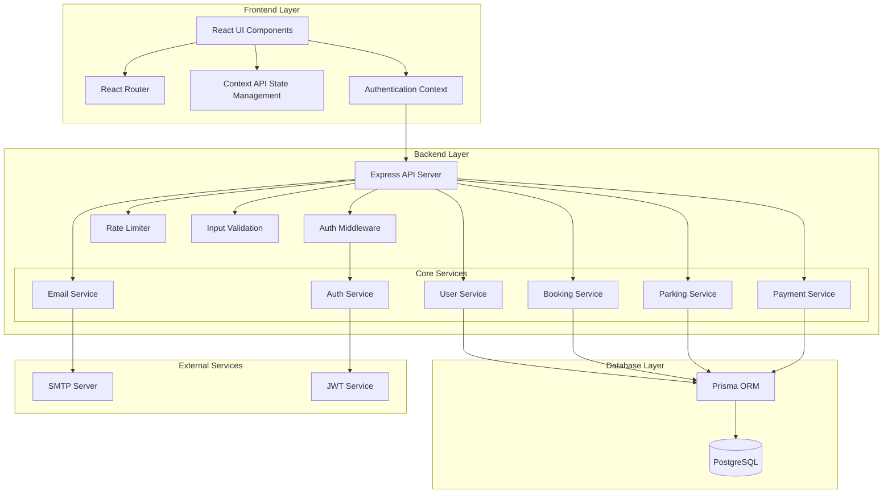
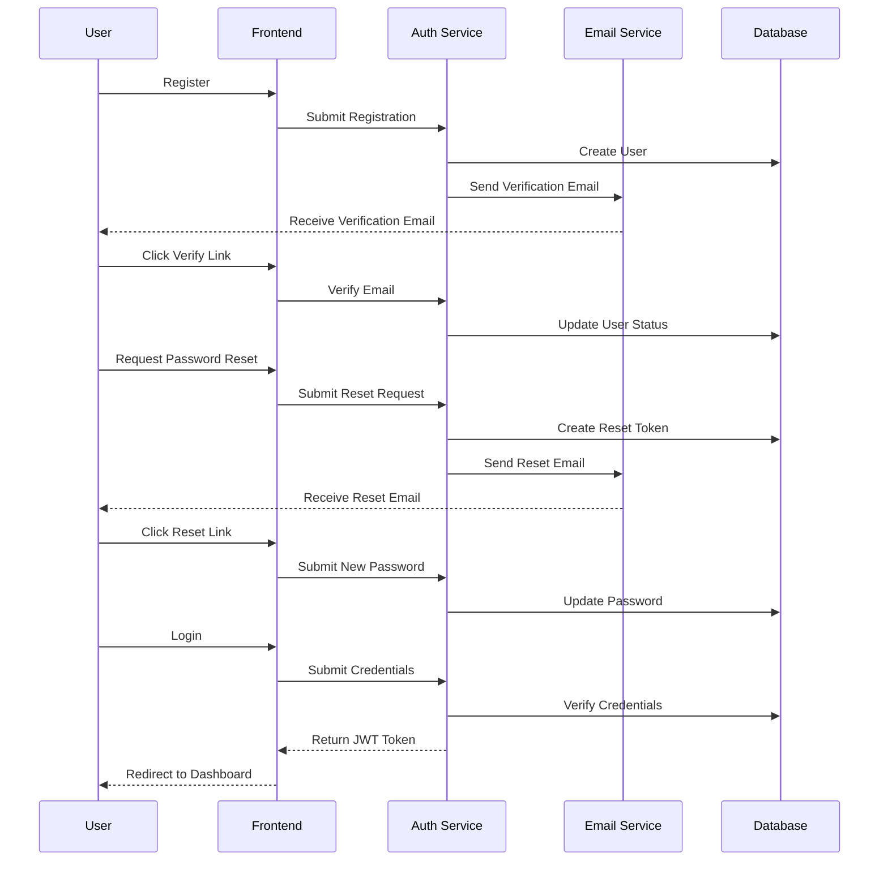
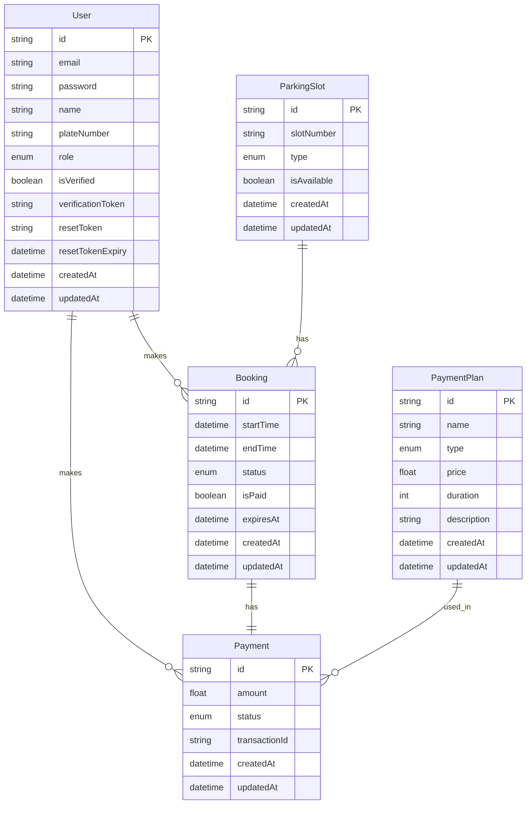

```mermaid
graph TB
    subgraph "Frontend Layer"
        UI[React UI Components]
        Router[React Router]
        State[Context API State Management]
        Auth[Authentication Context]
    end

    subgraph "Backend Layer"
        API[Express API Server]
        Auth_M[Auth Middleware]
        Rate_L[Rate Limiter]
        Valid[Input Validation]
        
        subgraph "Core Services"
            UserS[User Service]
            BookingS[Booking Service]
            ParkingS[Parking Service]
            PaymentS[Payment Service]
            EmailS[Email Service]
            AuthS[Auth Service]
        end
    end

    subgraph "Database Layer"
        DB[(PostgreSQL)]
        Prisma[Prisma ORM]
    end

    subgraph "External Services"
        SMTP[SMTP Server]
        JWT[JWT Service]
    end

    %% Frontend connections
    UI --> Router
    UI --> State
    UI --> Auth
    Auth --> API

    %% Backend middleware connections
    API --> Auth_M
    API --> Rate_L
    API --> Valid

    %% Service connections
    Auth_M --> AuthS
    API --> UserS
    API --> BookingS
    API --> ParkingS
    API --> PaymentS
    API --> EmailS

    %% Database connections
    UserS --> Prisma
    BookingS --> Prisma
    ParkingS --> Prisma
    PaymentS --> Prisma
    Prisma --> DB

    %% External service connections
    EmailS --> SMTP
    AuthS --> JWT

```

```mermaid
sequenceDiagram
    participant U as User
    participant F as Frontend
    participant A as Auth Service
    participant E as Email Service
    participant D as Database

    %% Registration Flow
    U->>F: Register
    F->>A: Submit Registration
    A->>D: Create User
    A->>E: Send Verification Email
    E-->>U: Receive Verification Email
    U->>F: Click Verify Link
    F->>A: Verify Email
    A->>D: Update User Status

    %% Password Reset Flow
    U->>F: Request Password Reset
    F->>A: Submit Reset Request
    A->>D: Create Reset Token
    A->>E: Send Reset Email
    E-->>U: Receive Reset Email
    U->>F: Click Reset Link
    F->>A: Submit New Password
    A->>D: Update Password

    %% Login Flow
    U->>F: Login
    F->>A: Submit Credentials
    A->>D: Verify Credentials
    A-->>F: Return JWT Token
    F-->>U: Redirect to Dashboard
```

```mermaid
erDiagram
    User {
        string id PK
        string email
        string password
        string name
        string plateNumber
        enum role
        boolean isVerified
        string verificationToken
        string resetToken
        datetime resetTokenExpiry
        datetime createdAt
        datetime updatedAt
    }

    ParkingSlot {
        string id PK
        string slotNumber
        enum type
        boolean isAvailable
        datetime createdAt
        datetime updatedAt
    }

    Booking {
        string id PK
        datetime startTime
        datetime endTime
        enum status
        boolean isPaid
        datetime expiresAt
        datetime createdAt
        datetime updatedAt
    }

    PaymentPlan {
        string id PK
        string name
        enum type
        float price
        int duration
        string description
        datetime createdAt
        datetime updatedAt
    }

    Payment {
        string id PK
        float amount
        enum status
        string transactionId
        datetime createdAt
        datetime updatedAt
    }

    User ||--o{ Booking : "makes"
    User ||--o{ Payment : "makes"
    ParkingSlot ||--o{ Booking : "has"
    Booking ||--|| Payment : "has"
    PaymentPlan ||--o{ Payment : "used_in"
```